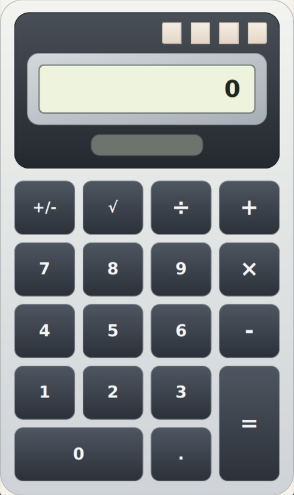

# Basic Calc

Basic Calc is a compact desktop calculator built with C++, CMake, and Qt Widgets.



## Features

- Four basic operations: addition, subtraction, multiplication, and division
- Square root and sign toggle
- Repeated equals behavior for quick chained calculations
- Compact 12-character display formatting with scientific notation fallback
- Desktop integration for Linux with app icon and launcher metadata

## Keyboard shortcuts

The calculator can be used entirely from the keyboard:

- `0`-`9` enter digits
- `.`, `,` enter a decimal point
- `+`, `-`, `*`, `X`, `/` trigger arithmetic operators
- `=` , `Enter`, `Return` evaluate the expression
- `S` applies square root
- `N` toggles the sign
- `Delete` resets the calculator to `0`

## Build on Linux

### Requirements

- CMake 3.21 or newer
- A C++20 compiler
- Qt Widgets development packages, preferably Qt 6

### Build steps

```bash
cmake -S . -B build
cmake --build build
```

### Run

```bash
./build/basic-calc
```

### Run tests

```bash
ctest --test-dir build --output-on-failure
```

## Build on Windows

### Requirements

- CMake 3.21 or newer
- Qt 6 Widgets for Windows
- A compiler supported by your Qt installation, such as MSVC

### Build steps

Open a terminal where Qt and your compiler are available, then run:

```powershell
cmake -S . -B build
cmake --build build --config Release
```

If CMake cannot find Qt automatically, set `CMAKE_PREFIX_PATH` to your Qt installation, for example:

```powershell
cmake -S . -B build -DCMAKE_PREFIX_PATH="C:\Qt\6.8.0\msvc2022_64"
cmake --build build --config Release
```

### Run

```powershell
.\build\Release\basic-calc.exe
```

For single-config generators such as Ninja, the executable may be located at `.\build\basic-calc.exe`.

## Project layout

- `src/` application UI and calculator engine
- `tests/` engine tests
- `art/` screenshots and icon assets

## License

This project is licensed under the MIT License. See [`LICENSE`](LICENSE).
